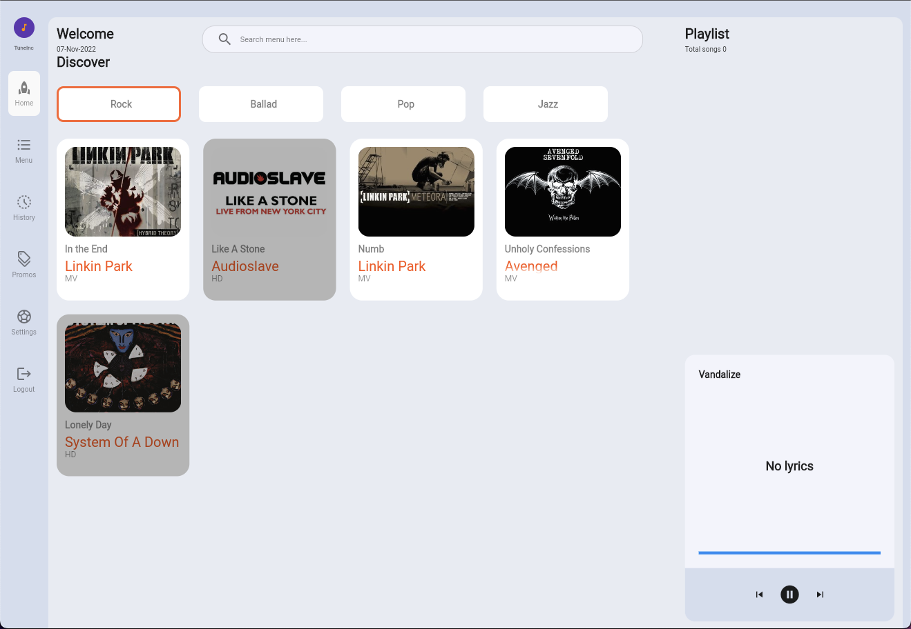
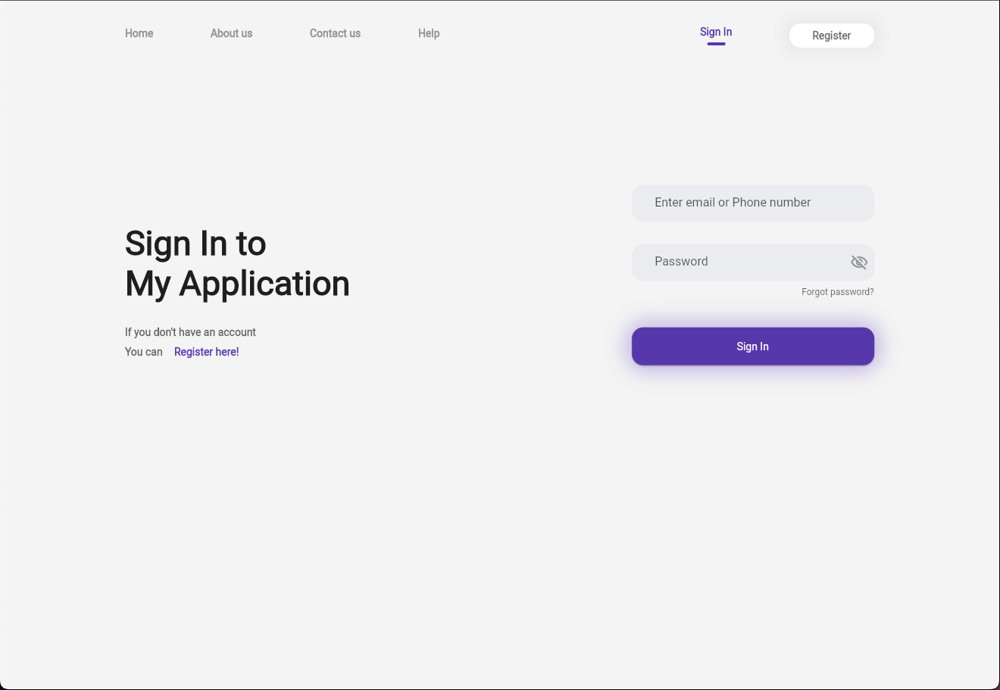
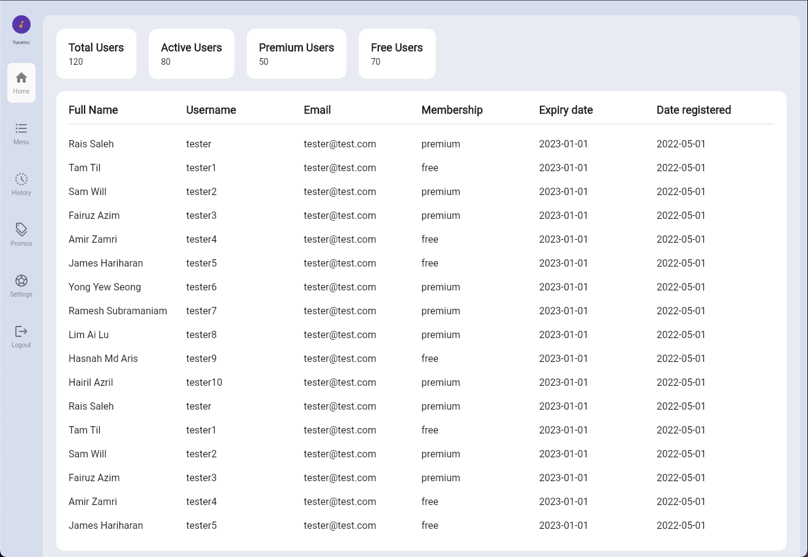

# TuneInc

Test Case for Music Player UI

## To-Do List App

This project is for Music Player UI app.

What can be done inside this app?

- Add songs into playlist
- See the songs list for premium and free users
- Admin can view user data

To login as admin, just input 'admin' in the username field and press login

#### Packages used for this project

- [get](https://pub.dev/packages/get)

#### What can be improved from here

- Finish the app.